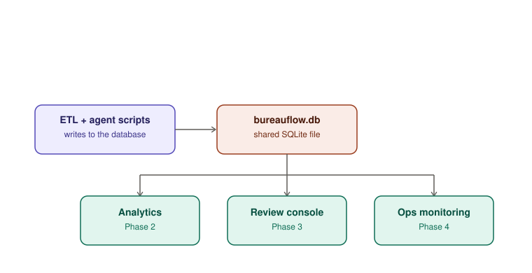

# BureauFlow

**An end-to-end synthetic credit-dispute platform — data engineering, SQL
analytics, an agentic triage layer, and AI Ops monitoring, all built on one
shared database.**



## Results

- **5,296** clean records loaded from **6,124** raw rows — the rest rejected with a logged reason for each, nothing silently dropped
- **93.3%** dispute-classification accuracy on the agent's evaluation set — 96.5% on the items it auto-routed vs. 83.3% on the ones it escalated to a human, which is exactly the split a well-calibrated policy engine should produce
- **4 phases, one database**: ETL → SQL/dashboard analytics → human-in-the-loop agent → AI Ops monitoring

**Built with:** Python · pandas · SQLite · Streamlit · scikit-learn · seaborn/matplotlib

Built on public FCRA/credit-reporting domain concepts. **All data is
synthetic — no real consumer or employer data is used anywhere in this repo.**

## Why this project

Disputes go through intake → investigation → response, against a 30-day
regulatory clock. This project models that lifecycle end-to-end: generate
realistic messy data, clean and validate it, and land it in a schema built
for analytics (Phase 2) and an agent layer (Phase 3).

## Project structure

```
bureauflow/
├── sql/
│   └── schema.sql          # star schema: dims + fact_dispute + etl_rejects
├── src/
│   ├── generate_raw_data.py  # creates messy synthetic raw CSV
│   ├── init_db.py            # builds bureauflow.db from schema.sql
│   └── etl.py                # cleans raw data, loads star schema, logs rejects
├── data/raw/                 # generated CSVs (raw + reference lists)
├── bureauflow.db             # SQLite database (generated)
└── requirements.txt
```

## How to run

```bash
pip install -r requirements.txt
python src/init_db.py           # (re)builds an empty bureauflow.db
python src/generate_raw_data.py # writes data/raw/disputes_raw.csv
python src/etl.py               # cleans + loads into bureauflow.db
```

Each run of `etl.py` prints a load summary, e.g.:

```
Raw rows read:        6124
Loaded to fact_dispute: 5296
Rejected (see etl_rejects): 828
Reject breakdown:
  invalid reason_code: 257
  unparseable received_date: 171
  duplicate dispute_id: 124
  ...
```

## Data model

**Star schema**, SQLite:
- `fact_dispute` — one row per dispute: dates, channel, SLA breach flag, status
- `dim_consumer`, `dim_furnisher`, `dim_bureau`, `dim_reason` — lookups
- `etl_rejects` — every row the ETL refused to load, with a reason and the
  original raw payload (JSON) for debugging. Nothing is silently dropped.

**Data quality rules enforced by the ETL** (see `src/etl.py`):
- No duplicate `dispute_id`
- `consumer_id` and `furnisher_id` required and must resolve to a known dimension row
- `bureau_name` normalized from raw variants (`"EQF"`, `"equifax"`, `"Trans Union"`, …) to a canonical bureau
- `reason_code` must exist in `dim_reason`
- Dates parsed across three raw formats; unparseable dates rejected
- `response_date` may not precede `received_date`
- SLA breach computed as `days_to_respond > 30`

## Open in DBeaver

1. **Database → New Database Connection → SQLite**
2. Path: point it at `bureauflow.db` in this folder
3. If DBeaver prompts to download the SQLite JDBC driver, allow it
4. Browse `fact_dispute` and the `dim_*` tables directly, or run SQL in the editor, e.g.:

```sql
SELECT status, COUNT(*) FROM fact_dispute GROUP BY status;

SELECT r.reason_description,
       ROUND(100.0 * SUM(f.sla_breached) / COUNT(*), 1) AS breach_pct
FROM fact_dispute f
JOIN dim_reason r ON f.reason_code = r.reason_code
WHERE f.status = 'Closed'
GROUP BY r.reason_description
ORDER BY breach_pct DESC;
```

## Phase 2 — Analytics + dashboard

`dim_furnisher` now carries a `quality_tier` (`good` / `average` / `poor`),
and closed disputes get a reinvestigation `outcome`
(`verified` / `updated` / `deleted`) weighted by that tier — a furnisher's
own accuracy history drives its disputes' outcomes, the way it would in
practice. This is what makes furnisher error-rate analysis meaningful.

**If you already ran Phase 1 before this was added**, re-run the pipeline
so your database picks up the new column and outcome data:
```bash
python src/init_db.py
python src/generate_raw_data.py
python src/etl.py
```

**SQL:** `sql/analytics_queries.sql` — 10 queries answering real ops
questions (SLA trend, breach rate by reason, furnisher scorecard, repeat
disputers, channel/bureau comparison, backlog aging, ETL reject summary).
Run these directly in DBeaver.

**Dashboard:**
```bash
streamlit run src/dashboard.py
```
Opens in your browser at `http://localhost:8501`. It reads the same
`bureauflow.db` — no separate setup needed. KPI cards up top, then charts
(seaborn/matplotlib) and tables (pandas) for each of the questions above.

## Phase 3 — Agentic triage layer

New disputes now go through an agent before they ever become a case.
Nothing here touches your Phase 1/2 data — it's purely additive.

**One-time setup** (safe to run even if you already have data):
```bash
python src/init_agent_db.py           # adds 3 new tables to your existing bureauflow.db
```

**The pipeline:**
```bash
python src/generate_incoming_disputes.py   # creates 150 new synthetic submissions
python src/run_intake.py                   # agent classifies + retrieves guidance + proposes routing
streamlit run src/agent_console.py         # human reviews and approves/rejects
```

**How it works, step by step:**
1. `incoming_disputes` — new consumer submissions (free text), unprocessed
2. **Classify** (`src/agent_core.py`) — TF-IDF cosine similarity against reference guidance suggests a reason code + confidence. Not a hosted LLM — a deliberate, disclosed design choice: free, deterministic, fully explainable, and swappable for an embedding model or LLM call later without changing the pipeline shape.
3. **Retrieve** — the same TF-IDF index returns the most relevant guidance snippets for that dispute (real nearest-neighbor retrieval, not a lookup table)
4. **Policy engine** (`decide_policy` in `agent_core.py`) — routes to `auto_route` (pre-filled, one-click approval) or `escalate_human` (flagged for careful review) based on: high-risk reason codes (fraud/identity theft) always escalate; low classifier confidence escalates; furnishers with a poor track record get extra scrutiny
5. **`agent_review_queue`** — the agent's proposal, awaiting a human
6. **Human review console** (`agent_console.py`) — a reviewer sees the text, the suggestion, the confidence, the retrieved guidance, and the policy flag; can override the reason code; clicks Approve or Reject. **Nothing reaches `fact_dispute` without this click — including `auto_route` items.** That's the same hard constraint as the banking assistant project: the agent proposes, a human approves anything that hits the system of record.
7. On approval, a new `Open` case is written into `fact_dispute` (prefixed `AG` in `dispute_id`) and everything is logged
8. **Dual-storage audit log** — every step (classified / retrieved / policy_decision / human_decision / committed) is written to both `agent_audit_log` (SQLite, queryable) and `data/agent_audit_log.jsonl` (append-only), same pattern as the banking assistant

On the 150-item synthetic batch used to build this: the classifier matched the true reason code **93.3%** of the time overall — **96.5%** on the auto-routed items vs. **83.3%** on the escalated ones, which is exactly the behavior you want: the policy engine is correctly sending its least-confident calls to a human.

## Phase 4 — AI Ops layer

This is the layer that speaks directly to AI Ops / automation-engineer
roles: not just "does the agent work" but "how do you know it's still
working, and what does it cost."

**One-time setup:**
```bash
python src/init_ops_db.py   # adds latency/cost columns + eval_runs table
```
Run this **before** your next `generate_incoming_disputes.py` + `run_intake.py`
batch — those two scripts now record latency and a simulated cost per item,
and need the new columns to exist first.

**What's instrumented:**
- **Latency** — real wall-clock time for the classify and retrieve steps, in milliseconds (these are local TF-IDF operations, so this is genuine latency, not simulated)
- **Simulated cost** — `src/agent_core.py` estimates what this step would cost if routed through a hosted LLM instead of local TF-IDF (rough token count × an illustrative rate). This is clearly a simulation, not a real bill — the point is practicing cost-monitoring instrumentation, which is the same shape whether the underlying call is free or metered
- **Evaluation harness** (`src/eval_classifier.py`) — scores the classifier against `incoming_disputes.true_reason_code` (known only because this is synthetic data) and logs accuracy + per-reason precision/recall to `eval_runs`. Run it any time you want a fresh trend point:
  ```bash
  python src/eval_classifier.py
  ```

**Monitoring dashboard:**
```bash
streamlit run src/ops_dashboard.py
```
Shows: latest accuracy + escalation rate + avg latency + cumulative
simulated cost as KPIs, an accuracy-over-time trend line with an alert
threshold, confidence-score distribution, escalation rate by day,
latency box plot (p50/p95), cumulative cost curve, and a per-reason
precision/recall breakdown from the latest eval run. A simple alert
banner flags if accuracy drops below 85% or escalation rate climbs
above 45%.

## The complete picture

Four phases, one database, one interview narrative:
1. **Data engineering** — messy synthetic data → validated star schema, with a logged reject trail
2. **Data analysis** — SQL + a Streamlit ops dashboard answering real questions (SLA breaches, furnisher scorecards, repeat disputers)
3. **Agentic AI** — classify → retrieve → policy-route → human approval → dual-storage audit log, for every new dispute
4. **AI Ops** — latency, simulated cost, and a running evaluation set with accuracy monitoring and alerts

Tailor which phase you lead with per role: DE → Phase 1, DA → Phase 2, AI Ops/automation → Phases 3–4 together.
